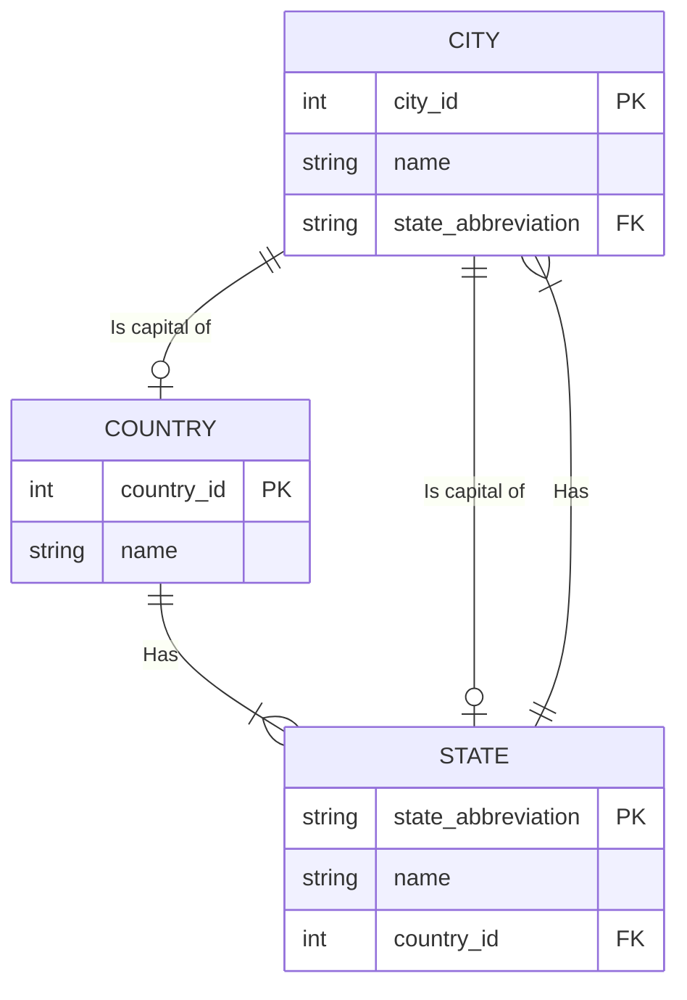
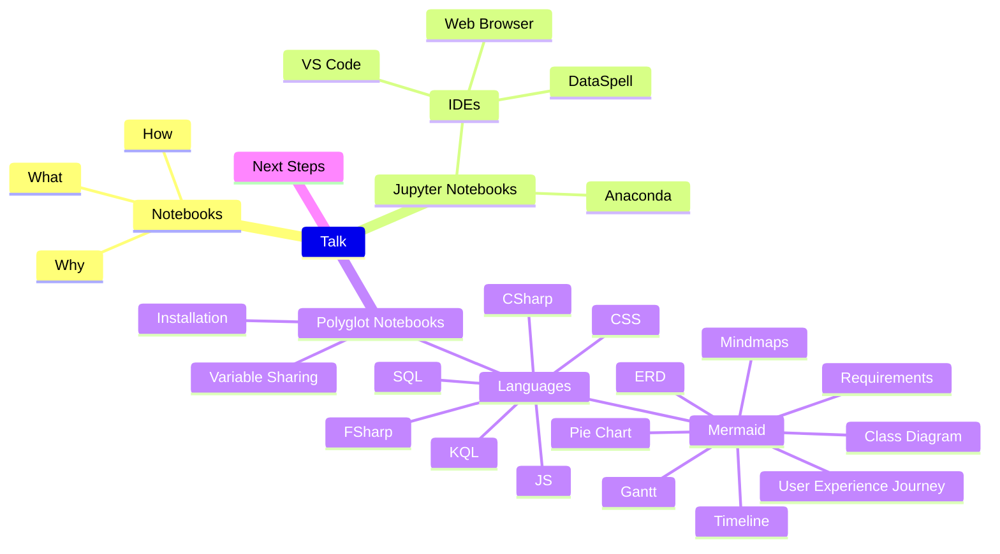

# Mermaid.js Samples

## Entity Relationship Diagram

See [My article on Mermaid.js ERDs](https://newdevsguide.com/2023/04/08/creating-erds-with-mermaid/) for more details

``` mermaid
erDiagram
    CITY {
        int city_id PK
        string name
        string state_abbreviation FK
    }
    STATE {
        string state_abbreviation PK
        string name
        int country_id FK
    }
    COUNTRY {
        int country_id PK
        string name
    }
    COUNTRY ||--|{ STATE : "Has"
    STATE ||--|{ CITY : "Has"
    CITY ||--o| STATE : "Is capital of"
    CITY ||--o| COUNTRY : "Is capital of"
```

```mermaid
mindmap
    Talk
        Notebooks
            What
            Why
            How
        Jupyter Notebooks
            IDEs
                VS Code
                DataSpell
                Web Browser
            Anaconda
        Polyglot Notebooks
            Installation
            Languages
                CSharp
                FSharp
                JS
                CSS
                SQL
                KQL
                Mermaid
                    Class Diagram
                    Gantt
                    Timeline
                    User Experience Journey
                    Pie Chart
                    ERD
                    Mindmaps
                    Requirements
            Variable Sharing
        Next Steps
```